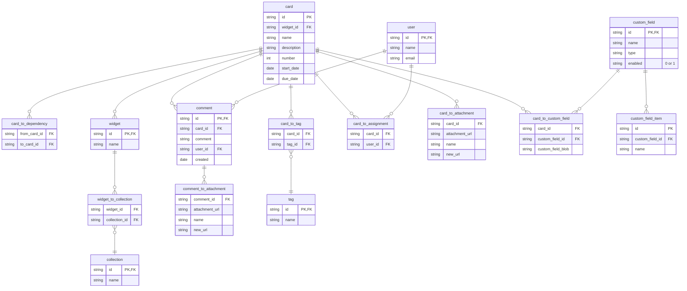

# Export Favro cards and information

Favro is a nice bug tracking system, but sometimes you are required to migrate to another system. This tiny Python project extracts the cards and a lot of other stuff from Favro and stores it in a local SQLite database.

When your data is in the database, it is easy to create files or calls to import it into your new bug tracking system.

## Requirements

- Python 3.10 or higher
- install the dependencies

  ```zsh
  pip install .
  ```

## Setup

Create a `config.env` file in the root of the project, which contains the following values:

- `ORGANIZATION_ID`: the identifier for your instance in Favro
- `API_KEY`: the authorization header that needs to be sent in each request. This value can be obtained by making a sample request with your user and the API key you created in Favro for this user and reading the authorization header in the request
- `MAX_SEQUENCE_NUMBER`: the highest sequence number for the cards in your Favro instance. To find this number, create a new dummy card somewhere, which has the highest sequence number

For example:

``` text
ORGANIZATION_ID=11a55553d38c111a579c5465
API_KEY=Basic ddduZS5zYWludC1naGlzbGFpxxxxx2t0b3Iuc2U6OW5XbDlabVVFNkRrSzU5ekpfOEJva1c2ejRjTnJNVlblablabla==
MAX_SEQUENCE_NUMBER=23508
```

## Run the export

From the command line from the root of this project:

```zsh
python main.py
```

## Database

The database is created in the `local` folder and is named `favro.db`.



## Attachments

Attachments are immediately downloaded to the folder `local/card_attachments` or `local/comment_attachments`, respectively, with the UUID name and extension of the file. The UUID name is also stored in the database. If you upload the attachments to an online reachable bucket afterwards, then you can use the `new_url` in the `card_to_attachment` and `comment_to_attachment` tables respectively.

## Limitations

No matter what privileges you have in Favro, you cannot request cards or widgets that belong to private collections. Nor can you get the private collection information.

## Possible improvements

### Favro rate limiting

Favro has rate limiting per user and the rate limit depends on your selected Favro plan. Currently, the script only uses one set of credentials, and has "wait" code implemented when you run out of requests.

Possible solutions:

- use multiple accounts to circumvent rate limiting and waiting times
- smarter requests

### Cards requested one by one

I opted to requests cards one by one, to ensure getting all cards. However, this results in more requests than are possibly necessary. Cards can also be requested per widget or collection they belong to, which would limit the amount of requests needed.

### Only unique cards

Cards in Favro can belong to multiple widgets in multiple collections in Favro, but this script does not collect all "versions" of a card. The cards are requested with the "unique" parameter set.

To get all versions, the database needs to be extended to catch both the card common ID, which is the same across all widgets and collections, and the widget specific card ID.

### Not all information is collected

I opted to not get certain information, like the parent ID that may be present in cards.

### Custom fields

Favro allows you to make as many custom fields as you want of various types. Depending on the custom field type, the custom field information in cards contains different fields.

Due to the different fields, the data from the custom fields is dumped as a text blob, which may be text, a number or a JSON object.

Most of the custom field types and their content is described in the Favro API documentation, but not all of them and some of the documentation is incorrect.
